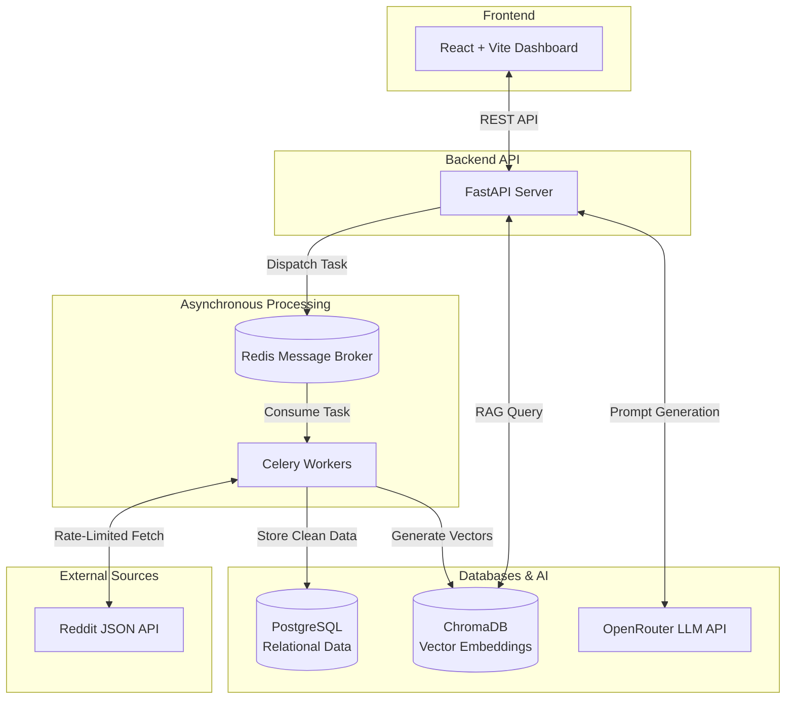

<div align="center">
  <h1>🧠 AI-Powered Market Intelligence Platform</h1>
  <p><strong>A Distributed ETL Pipeline & Deep Research Swarm for Social Data Analytics</strong></p>
</div>

<br/>

> **Business Value:** This platform autonomously extracts, processes, and analyzes thousands of unstructured social media discussions (Reddit) to provide actionable market intelligence, hiring trends, and sentiment analysis for enterprise decision-makers.

## 🚀 Why This Project Stands Out (For Recruiters & Hiring Managers)

Most portfolio projects are simple CRUD applications. This project is a **production-ready distributed system** built to solve real-world engineering chaos:

*   **Distributed Architecture:** Separates the web server (FastAPI) from heavy background processing tasks (Celery/Redis) to ensure the UI never freezes during massive data ingestion.
*   **Robust ETL Pipeline:** Safely handles third-party API rate limits, exponential backoffs, and automated pagination to continuously scrape data without getting IP banned.
*   **Advanced AI Integrations:** Features a Retrieval-Augmented Generation (RAG) system with a local Vector Database (ChromaDB) and an intelligent rotational LLM fallback mechanism to ensure 100% uptime even if primary AI models fail or run out of credits.
*   **Full-Stack Implementation:** A beautiful, responsive React frontend communicating via asynchronous API endpoints.

---

## 🏗️ System Architecture

The application is fully containerized using Docker, allowing all microservices to run in isolation and scale independently.



---

## 🛠️ Tech Stack

### Frontend
- **React 18** (Vite)
- **Vanilla CSS** (Custom Glassmorphism Design System)
- **Lucide React** (Icons)

### Backend & Infrastructure
- **Python 3.12+**
- **FastAPI** (Asynchronous REST API)
- **SQLAlchemy** (Async ORM)
- **Celery & Redis** (Distributed Task Queue)
- **Docker & Docker Compose** (Containerization)

### AI & Data Engineering
- **PostgreSQL** (Primary Datastore)
- **ChromaDB** (Vector Database for Semantic Search)
- **OpenRouter API** (LLM Provider with Rotational Fallbacks)
- **VADER Sentiment / Spacy** (NLP Extraction)

---

## 📂 Project Structure

```text
reddit-intelligence/
├── backend/
│   ├── api/
│   │   └── main.py          # 🚀 Main FastAPI application entry point
│   ├── agents/              # Autonomous AI Agents for Deep Research
│   ├── analytics/           # NLP, Sentiment, and Skill Extraction engines
│   ├── database/            # PostgreSQL Models & Alembic Migrations
│   ├── etl/                 # Celery Tasks, Reddit Extraction Pipeline
│   └── services/            # RAG, Embeddings, API Key Managers
├── frontend/
│   ├── src/                 # React UI Components and Pages
│   ├── public/              # Static Assets
│   ├── package.json         # Node Dependencies
│   └── vite.config.js       # Vite Configuration
├── docker-compose.yml       # Infrastructure orchestration
├── requirements.txt         # Python Dependencies
└── README.md                # Project Documentation
```

---

## ⚙️ Getting Started (Local Development)

### Prerequisites
- Docker and Docker Compose installed
- Node.js (v18+) installed
- OpenRouter API Key (Free tier works perfectly)

### 1. Configure Environment Variables
Clone the repository and create a `.env` file in the root directory:
```bash
cp .env.example .env
```
Add your `OPENROUTER_API_KEYS` inside the `.env` file.

### 2. Launch the Backend Infrastructure
The entire backend ecosystem (Database, Cache, API, Workers) is containerized.
```bash
docker compose up -d
```
*(Note: Run `docker compose exec app alembic upgrade head` if database migrations are required on the first run).*

### 3. Launch the Frontend Dashboard
Open a new terminal window and start the React application:
```bash
cd frontend
npm install
npm run dev
```

### 4. Explore the Platform
Open your browser and navigate to `http://localhost:5173`. 
- **Admin Panel:** Schedule automated background scrapes.
- **Dashboard:** View real-time ingestion metrics and sentiment charts.
- **Deep Research:** Ask the AI agent complex questions about the extracted data!
